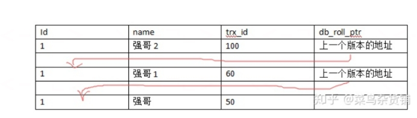
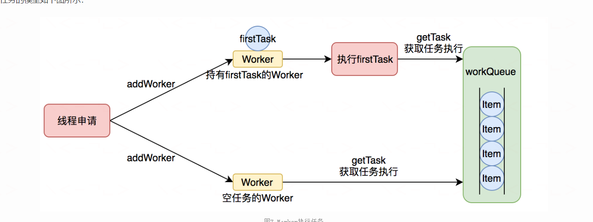
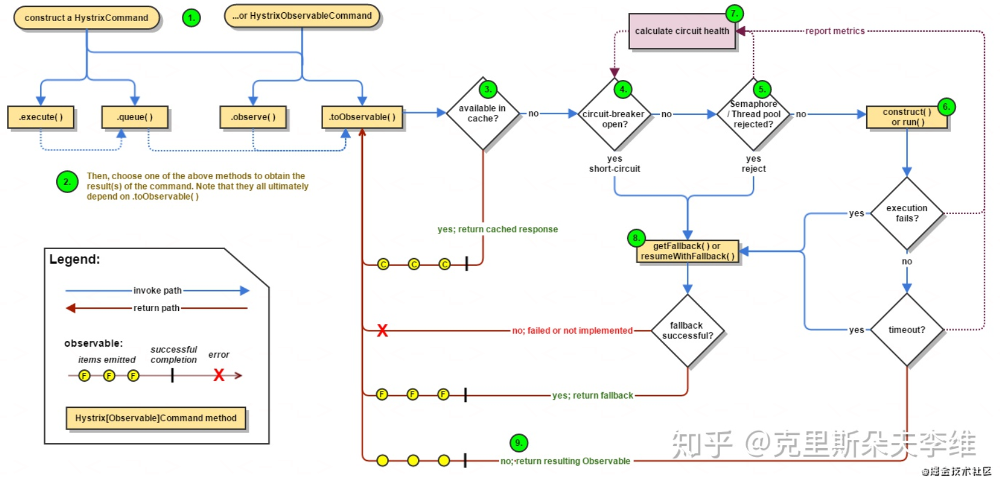
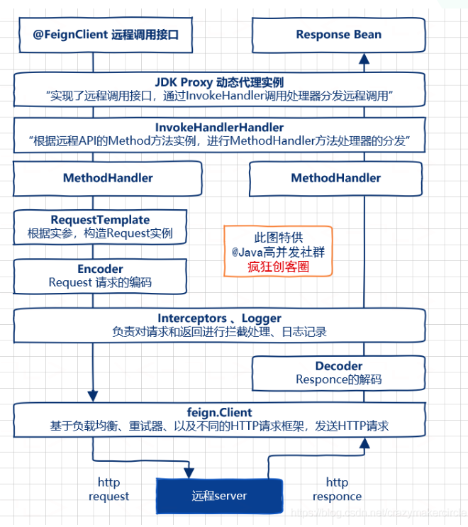

#  mysql

1. 为什么mysql索引使用B+树而不是B树

   ​		答：B+树会把我们所有的数据存贮到叶子节点，而且叶子结点直接按可以做顺序存放；进行范围查找跨页数据的时候，B由于B树的不确定性（数据有可能在叶子节点也可能在根节点，需要多次随机访问磁盘才能找出对应数据）。但是B+树由于数据全部在叶子几点，而且叶子之间跟链表一样顺序存放，我们可以像链表一样遍历我们的范围数据

 

2. Mysql的mvcc

   ​		Mysql的innerDb实现的mvcc，我们的mysql事务中的读提交和可重复读都是通过mvcc进行实现的。InnerDb的undolog行记录有两个列，trx_id和db_roll_ptr，其中trx_id就是我们常说的事务id，每次新增一个事务的时候，事务id就会+1，所以通过事务id能够判断我们的一个事务执行顺序，innerDb每次执行更新的时候会在undolog里面生成一个事务更新记录，这个记录会关联我们的一个事务id。这个就是我们mvcc的多版本的含义，就是每次更新都记录了一个更新记录，而且是一个更新版本链，他们有逻辑关系。当没有事务关联这个记录的时候，这个记录才被允许删除。db_roll_ptr作用是指向上一个版本地址，相当于版本链的指针。

 

 

3. Mysql怎么利用mvcc实现读提交和可重复读的隔离级别

已提交读和可重复读的大实现区别在于他们生成视图的策略不同。视图中有个列表保存了系统中当前活跃的读写事务，通过这个列表来判断记录的某个版本是否对当前事务可见。其中最重要的几个属性为：

​		a. up_limit_id:当前已提交的事务号+1，当前事务号<up_limit_id的数据都是可见的。也就是说创建事务的时候，之前已经提交的事务对于当前视图来说是可见的

​		b. low_limit_id:当前最大事务号+1，当前事务号>=low_limit_id的数据都是不可见的，也就是说，在创建事务之后创建的事务对于当前视图来说肯定是不可见的

​		c. trx_ids：当前活跃的事务号列表，当前事务开启创建视图时候，都有哪些事务是开启但未提交的。

​		对于读提交和可重复读来说，他们的版本比较可见性策略其实都是一样的，他们的区别在于创建视图的时机：读提交是在事务执行到sql语句的时候才开始创建的视图，这时候获取up_limit_id很可能比事务刚开启时候的高，这时候看到的数据也就不一样，能看到更高版本的数据。可重复读创建视图的时机是开启事务的时候就创建视图，开启事务的那一刹那就决定了你能看到哪个版本的数据。但是如果事务里面有更新的话，会导致当前数据获取一次当前读。因为自己更新，再次读肯定要获取最新更新的数据。

 

 

# **Jvm**

 

1. Cms垃圾收集器

   Cms垃圾收集过程：

   a. 初始标记：仅仅是标记一下gc roots能直接关联到的对象，很快

   b. 并发标记：会进行可达性分析计算，标识回收对象

   c. 重新标记：修正并发标记期间系统产生的新的垃圾

   d. 并发清除：清除数据

   Cms停顿时间较少，但是对cpu比较敏感，而且进行并发标记和并发清除的时候会占用cpu资源，默认启动回收线程数量是（cpu数量+3）/4，所以，cpu数量较少的时候影响很大

    

2.G1垃圾收集器

​	G1垃圾收集过程：


# jdk源码和底层原理

## HashMap

1. 为什么hashmap的长度都是去2的次幂-1
   - 这样运算更快，按位与运算中，（2的次幂-1）的长度和在同样的二进制位数长度里面，比如说15和8，他们的运算速度是一样的。因为他们都只运算四个位数的与运算（1111和1000）。
   - 能更少的减少hash曹重复，数组散列性更好。因为按位与运算的时候，如果长度不是全部是1，那么在0的位置运算永远都是0.会造成有些数字永远也取不到。如果说如果长度15，15-1=14,1110，在这15个槽里面，任何1结尾的二进制数字（奇数）下标都无法被计算到，也就无法被放入元素，造成空间浪费。
2. CurrentHashMap扩容怎么保证线程安全
3. CurrentHashMap的size()方法
   - ​	由于CurrentHashMap一般来说都是并发执行的，所以我们在统计长度的时候，不一定正确，而且并发情况下，长度很有可能超过int最大值，所以jdk推荐使用mappingCount（）方法，他们内部都是sumcount（）方法进行实现的，sumcount（），sumcount（）内部则是便利CounterCell数组，得出长度

## AQS

1. aqs的state为-1时，代表禁止中断线程，直到任务执行

2. AQS内部维护一个线程的队列。队列由内部的节点组成。

   队列的节点为`Node`,节点分为`SHARED`和`EXCLUSIVE`分别时共享模式的节点和独占模式的节点。

   节点的等待状态为`waitStatus`

   - CANCELLED（1）：取消状态，当线程不再希望获取锁时，设置为取消状态
   - SIGNAL（-1）：当前节点的后继者处于等待状态，当前节点的线程如果释放或取消了同步状态，通知后继节点
   - CONDITION（-2）：等待队列的等待状态，当调用signal()时，进入同步队列
   - PROPAGATE（-3）：共享模式，同步状态的获取的可传播状态
   - 0：初始状态

3. state （private volatile int state;）

   - 使用unsafe。compareandswap方法保证线程安全访问修改（cas思想）

## 线程池ThreadPoolExecutor

线程池为了掌握线程的状态并维护线程的生命周期，设计了线程池内的工作线程Worker。我们来看一下它的部分代码：

```Java
private final class Worker extends AbstractQueuedSynchronizer implements Runnable{
    final Thread thread;//Worker持有的线程
    Runnable firstTask;//初始化的任务，可以为null
}
```

Worker这个工作线程，实现了Runnable接口，并持有一个线程thread，一个初始化的任务firstTask。thread是在调用构造方法时通过ThreadFactory来创建的线程，可以用来执行任务；firstTask用它来保存传入的第一个任务，这个任务可以有也可以为null。如果这个值是非空的，那么线程就会在启动初期立即执行这个任务，也就对应核心线程创建时的情况；如果这个值是null，那么就需要创建一个线程去执行任务列表（workQueue）中的任务，也就是非核心线程的创建。


   
线程池需要管理线程的生命周期，需要在线程长时间不运行的时候进行回收。线程池使用一张Hash表去持有线程的引用，这样可以通过添加引用、移除引用这样的操作来控制线程的生命周期。这个时候重要的就是如何判断线程是否在运行。

Worker是通过继承AQS，使用AQS来实现独占锁这个功能。没有使用可重入锁ReentrantLock，而是使用AQS，为的就是实现不可重入的特性去反应线程现在的执行状态。

1.lock方法一旦获取了独占锁，表示当前线程正在执行任务中。 2.如果正在执行任务，则不应该中断线程。 3.如果该线程现在不是独占锁的状态，也就是空闲的状态，说明它没有在处理任务，这时可以对该线程进行中断。 4.interruptIdleWorkers回收线程方法会使用tryLock方法来判断线程池中的线程是否是空闲状态；如果线程是空闲状态则可以安全回收。

# 分布式

## 熔断



## feign原理




## eureka三级缓存

1. 一级缓存（注册表）ConcurrentHashMap，二级缓存（ReadWriteMap）guava#LoadingCache，三级缓存（ReadOnlyMap）ConcurrentHashMap

2. 注册一个服务实例,向注册表中写入服务实例信息，并使得二级缓存失效

3. 寻找一个服务，从三级缓存中找，如果有则返回，如果没有则去二级缓存拿并更新，如果二级缓存已经失效，触发guava的回调函数从注册表中同步。

4. 数据同步定时器

   每 30s 从二级缓存向三级缓存同步数据

   - 二级缓存有效
     - 从二级缓存向三级缓存同步数据
   - 二级缓存失效
     - 触发二级缓存的同步（从注册表中拉取数据）

   ## zookeeper

   1. zookeeper重要概念

      - Server id（sid，也叫myId）编号越大在选举时候选择算法权重越大，初始启动时候zxid都是0，这时候比的就是sid，
      -  事务id（Zxid）zookeeper通常以事务id（zxid）来标识数据的新旧程度，zxid越大，代表的数据版本越新，选leader的时候自然会优先选。
      - Epoch：逻辑时钟，也叫投票的次数，同一轮投票过程中的逻辑时钟值是相同的，每投完一次票这个数据就会增加。

   2. zookeeper启动选举机制

      - 每个节点都维护一个票箱，刚开始投票的时候，由于都不知道大家的zxid，都认为自己的zxid是最大的，所以投票都投自己，投出来的票信息包括自己的zxid和和sid。
      - 第一轮投票结束后，统计票箱信息，发现没有任何一个节点得票数超过总节点数的一半，就找出最大zxid的节点，然后发起第二轮投票，投给他，依次类推，知道有个节点票数超过了总结点数一半，投票就结束了
      - 选出leader，修改自己状态，LOKKING改为FOLLOWING，leader状态改为LEADING
      - 选出leader后，后续再注册进来的节点发现投票结束有leader了，就会把自己LOOKING改为FOLLOWING状态

   3. 运行期间选举

      ​	在 ZooKeeper 运行期间 Leader 和 非 Leader 各司其职，当有非 Leader 服务器宕机或加入不会影响 Leader，但是一旦 Leader 服务器挂了，那么整个 ZooKeeper 集群将暂停对外服务，会触发新一轮的选举。这时候各个服务器的zxid都不一样，也可能一样。

      - 第一次投票，每台机器都会将票投给自己。
      - 接着每台机器都会将自己的投票发给其他机器，如果发现其他机器的 zxid 比自己大，那么就需要改投票重新投一次。比如 server1 收到了三张票，发现 server2 的 xzid 为 102，pk 一下发现自己输了，后面果断改投票选 server2 为老大。
      - zxid相同时，比较sid

   4. zookeeper脑裂

      ​	假如说某个leader假死了，然后别人选出来了先的leader，然后老的leader又复活了，这时候老的leader发出写命令是被从节点拒绝掉的，因为每次选举都会维护一个递增Epoch，从节点发现Epoch小于当前，就会拒绝同步

