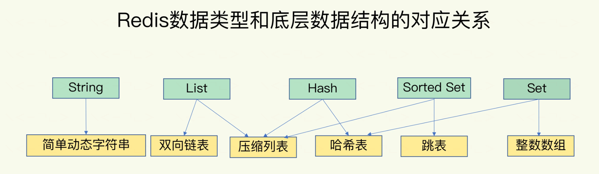
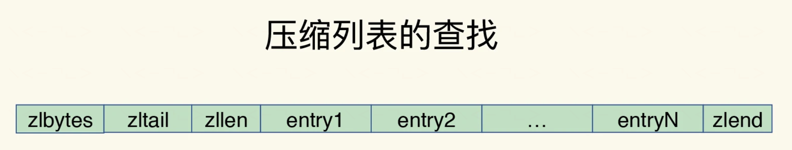

#                                       面试知识总结

## redis

​		redis是基于内存访问的数据库，其存储格式是一个大的全局hash表，其储存方式有点像java的hashMap（1.7）

### 数据结构	

​		redis的键值对数据结构，也就是数据的保存形式，分为**String,List,Hash,Set,Sort Set**五种数据结构。但是这五种数据结构却是由6种底层的数据结构组成的，这6种底层数据结构分别为**简单动态字符串、双向链表、压缩列表、hash表、跳表、整数数组**，这几种底层数据结构共同实现了我们的上述的五种数据结构，他们对应关系如下图：



可以看到，我们的value在存储的时候，**除了String是简单动态字符串意外，其余用的都是集合**

#### 底层数据结构

1. 简单动态字符串（Simple Dynamic String）

   ​		简单动态字符串，简称sds，是 Redis 底层所使用的字符串表示，  在 Redis 中， 客户端传入服务器的协议内容、 aof 缓存、 返回给客户端的回复， 等等， 这些重要的内容都是由 sds 类型来保存的。

   ​		**先强调一下**：<font color=red>当我们往redis防放一个字符串类型的value的时候，redis保存的其实是一个sds对象，但是如果我们同样命令放的是一个long类型的数字的时候，他保存的其实是一个long类型的值</font>

   ​		sds在redis中实现了字符串对象完美替代了C语言自带的char\*。redis不用原生字符串主要是char\*封装层次太低，满足不了redis对字符串的一些查询和操作（比如说长度统计和拼接）；sds对象的机构如下：

   ```c
   typedef char *sds;
   struct sdshdr {
       // buf已使用长度
       int len;
   
       // buf可用长度
       int free;
   
       // 实际保存字符串数据的地方
       char buf[];
   };
   ```

   与传统char\*相比，有以下优势：

   - 长度统计

     char\*需要遍历，O(n) ，sds直接返回len属性即可

   - 字符串拼接

     ​		char\*每次需要重新复制拼接字符串，有点像java的String；

     ​		sds第一次创建的时候buf使用长度=len+1（因为C的字符串都有个\0结尾标识，浪费），当第一次发生append的时候，和char\*比较类似，都必须进行复制，因为初始创建的时候buf数组没有预留空间，数组都满了。但是append的时候，产生新的sds的字符串，buf数组长度会留出当前使用长度一倍的预留空间，比如说拼接后len==18，那么buf长度=18+18+1，free长度==18，下次再append的时候，只要是没有超过free，就直接进行buf拼接即可。这种拼接方式会造成内存空间的浪费，但是由于一般情况下redis需要拼接的字符串还是比较少的，占内存体积也不大，一般可以接受。但如果这种字符串比较多又比较大，那就可能要修改redis服务器，让他定时释放一些字符串的预分配内存。

   - 二进制安全

     二进制安全是一种主要用于字符串操作函数相关的计算机编程术语。一个二进制安全函数，其本质是将操作输入作为原始的、无任何特殊字符意义的数据流。其在操作上应包含一个字符所能有的256种可能的值（假设为8比特字符）

     - 那什么是特殊字符？ 标记字符，如转义码，\0结尾的字符串（如C语言中的字符串），不是二进制安全的。
     - 场景 在处理未知格式的数据，例如随意的文件、加密数据及类似情况时，二进制安全功能是必须的。函数必须知道数据长度，以便函数操作整体数据。

     Redis 除了处理 C 字符串之外， 还需要处理单纯的字节数组， 以及服务器协议等内容，很显然，以\0结尾的char\*不能满足二进制安全的需要。

2. 双向链表

3. 压缩列表

   压缩列表实际上类似于一个数组，但是压缩列表的数据头部的三个位置保存了三个字段zlbytes（列表长度）、zltail（列表尾部偏移量）和zllen（列表中entry个数），压缩列表尾部还有个zlend，表示列表结束

   

   可以看到，压缩列表对于访问最后一个元素和第一个元素是比较友好的，复杂度是O(1),引申可以用这种数据结构实现队列

4. 跳表

5. hash表

6. 整数数组

#### 键值数据结构

1. String(字符串)
2. List
3. Hash
4. Set
5. Sort Set

### redis单线程设计

### redis扩容

### redis持久化

### redis集群部署

### 面试题

- 问：redis的String底层是什么数据结构实现的，为什么

  答：redis是使用redis自己写的sds简单动态字符串实现的；使用sds有以下几个好处：

  1. C自带的char\*具备统计长度功能，需要进行遍历，sds对象记录了当前字符串长度
  2. char\*再进行拼接的时候是进行复制的，sds在复制的时候会利用预留空间，优化了复制的性能
  3. 以\0结尾的char\*不具备二进制安全要求，而redis出了要处理单纯的字符串数组外，还要处理单纯的字节数组服务器协议等。

- 问：整数数组和压缩列表访问并没有太大的性能优势，但redis为什么还是用他们

  答：Redis底层使用的数组和压缩列表大小限制在64个字节以下，当大于64个字节的时候就会转变为跳表或者hash表数据结构，这样设计原因是数组结构这种连续空间访问的cpu缓存访问速度优势，但是当数组长度大于64字节的时候，会有cpu随机访问的问题，一下子放不进去缓存，所以这时候会把数据结构转换成hash或者跳表这种数据结构，降低查询复杂度。

  - 引申问：为什么超过64字节会造成cpu的随机访问问题

    答：cpu Cache是由很多的cacheline组成的，每个cacheline通常是64个字节，并且他有效引用主内存中的一块儿地址，访问数组每次从主内存中拿数据的时候，会把他相邻的数据一并捞进去，存入同一个cacheline。比如说一个long数组，一个long类型变量8个字节，每个cacheline最多存8个long型元素，那么每次访问这个long的数组内存到cache的时候，会把他相邻的另外7个也拉走，放到同一个cacheline。所以redis数组最大设计64个字节，有效保证最多做一次主内存访问即可。

  

